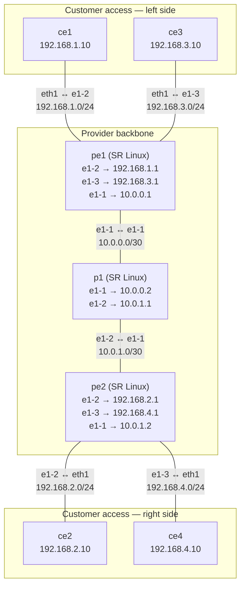

# SR Linux gNMI Bandwidth Allocation PoC

> Research proof-of-concept for the paper  
> **"Autonomous Agent-to-Agent Network Service Provisioning via Smart-Contract Escrow and Tokenized Authorization"**  
> — Orange Labs / Anthony Lambert

This repo isolates the **SDN activation step** of that paper's 6-stage workflow: given a service request from an AI agent, push a rate-limiting policy to a Nokia SR Linux provider-edge router via gNMI, enforce it with Linux `tc`, verify it with iperf3, and expose the entire operation as MCP tools so Claude or any MCP-compatible agent can call it directly as a function.

---

## Table of contents

- [Topology](#topology)
- [How packets flow](#how-packets-flow)
- [Prerequisites](#prerequisites)
- [Quick start](#quick-start)
- [How bandwidth allocation works](#how-bandwidth-allocation-works)
- [MCP server — agent integration](#mcp-server--agent-integration)
- [Connecting Claude Code](#connecting-claude-code)
- [Viewing the topology graph](#viewing-the-topology-graph)
- [Project layout](#project-layout)
- [Constraints and gotchas](#constraints-and-gotchas)
- [Phase roadmap](#phase-roadmap)

---

## Topology

### Visual map



> **Tip:** run `sudo containerlab graph -t topology/bandwidth-poc.clab.yml` while the lab is deployed to open an interactive web graph in your browser.

### Node reference

| Container name | Role | Kind | Image |
|---|---|---|---|
| `clab-bandwidth-poc-pe1` | Provider Edge 1 — two customer-facing ports | Nokia SR Linux `ixr-d2l` | `ghcr.io/nokia/srlinux:latest` |
| `clab-bandwidth-poc-pe2` | Provider Edge 2 — two customer-facing ports | Nokia SR Linux `ixr-d2l` | same |
| `clab-bandwidth-poc-p1` | Backbone / transit router | Nokia SR Linux `ixr-d2l` | same |
| `clab-bandwidth-poc-ce1` | Customer 1 — source host | Linux | `ghcr.io/hellt/network-multitool` |
| `clab-bandwidth-poc-ce2` | Customer 1 — destination host | Linux | same |
| `clab-bandwidth-poc-ce3` | Customer 2 — source host | Linux | same |
| `clab-bandwidth-poc-ce4` | Customer 2 — destination host | Linux | same |

### Two independent planes

**Management plane (`172.20.20.0/24`)**  
ContainerLab creates a dedicated Docker bridge network for management. Every node gets an IP there (dynamically assigned each deploy). This is the only network Python talks to — all gNMI calls go to `172.20.20.x:57400`. The Python code discovers these IPs at runtime with `docker inspect`.

**Data plane (veth pairs)**  
ContainerLab wires Docker `veth` pairs directly between containers to simulate physical cables. Each `endpoints` line in the topology YAML creates one veth pair. Traffic between CEs flows purely in the Linux kernel through these pairs.

---

## How packets flow

Example path: **ce1 → ce2** (customer 1, left to right)

```
ce1  (192.168.1.10)
  └─ default route via 192.168.1.1 → exits eth1
     pe1 ethernet-1/2.0  (192.168.1.1)
       └─ lookup 192.168.2.10 → static route: next-hop 10.0.0.2 (p1)
          pe1 ethernet-1/1.0  (10.0.0.1)  → exits toward p1
            p1 ethernet-1/1.0  (10.0.0.2)
              └─ lookup 192.168.2.10 → static route: next-hop 10.0.1.2 (pe2)
                 p1 ethernet-1/2.0  (10.0.1.1)  → exits toward pe2
                   pe2 ethernet-1/1.0  (10.0.1.2)
                     └─ lookup 192.168.2.10 → directly connected on ethernet-1/2.0
                        pe2 ethernet-1/2.0  (192.168.2.1)  → exits toward ce2
                          ce2  (192.168.2.10)  ✓
```

**4 hops.** All static routes — no OSPF, no BGP. Routing tables are pushed by `push-config.sh` at startup.

The same logic applies to ce3 → ce4, but via `pe1 ethernet-1/3.0` and `pe2 ethernet-1/3.0`.

---

## Prerequisites

- **Linux host** — ContainerLab requires Linux (native or WSL2 with Docker)
- **Docker** — `docker.io` or Docker Desktop
- **ContainerLab** — `bash -c "$(curl -sL https://get.containerlab.dev)"`
- **uv** — `curl -LsSf https://astral.sh/uv/install.sh | sh`
- No Nokia license needed — the free `srlinux` image works (with a 1000 PPS cap)

---

## Quick start

```bash
# 1. Clone
git clone https://github.com/musel25/srl-gnmi-bandwidth-poc.git
cd srl-gnmi-bandwidth-poc

# 2. Deploy the lab (needs sudo for ContainerLab to create veth pairs)
bash scripts/deploy.sh

# 3. Wait for SR Linux to boot (~60 s), then push router configs
sleep 60
bash scripts/push-config.sh

# 4. Verify end-to-end connectivity
bash scripts/connectivity-test.sh
# Expected: ping ce1→ce2 succeeds, traceroute shows 4 hops

# 5. Install Python dependencies
uv sync

# 6. Run the demo (two customers allocated simultaneously)
uv run python -m srl_bandwidth.demo
```

### What the demo does

```
Step 0  Wait for SR Linux gNMI to respond (up to 90 s)
Step 1  Measure baseline throughput: ce1→ce2 and ce3→ce4 (no limits)
Step 2  Allocate: orange-labs @ 5 Mbps on pe1/ethernet-1/2.0
        Allocate: inria-net   @ 3 Mbps on pe1/ethernet-1/3.0
Step 3  Verify: measured throughput matches each target ±20%
Step 4  Revoke both allocations
Step 5  Verify throughput returns to baseline
```

### Teardown

```bash
bash scripts/destroy.sh
```

---

## How bandwidth allocation works

This is the core of the PoC. Understanding it end-to-end explains why there are two enforcement mechanisms.

### The `ServiceRequest`

```python
from src.models import ServiceRequest

request = ServiceRequest(
    customer_id  = "orange-labs",       # opaque label — used for logging and naming
    pe           = "pe1",               # which SR Linux router to configure
    subinterface = "ethernet-1/2.0",    # which port.subif to cap (always .0 here)
    mbps         = 5.0,                 # target rate in Megabits per second
)
```

`subinterface` is `ethernet-1/N.0` — the `ethernet-1/N` part is SR Linux's interface name and `.0` is the subinterface index (SR Linux uses subinterfaces as the IP attachment point; index 0 means untagged).

### Step 1 — discover the management IP

ContainerLab assigns `172.20.20.x` addresses dynamically. Nothing is hardcoded. On every call:

```python
subprocess.check_output(["docker", "inspect", "clab-bandwidth-poc-pe1"])
# Parses JSON → finds the address in 172.20.20.0/24
# Returns e.g. "172.20.20.3"
```

### Step 2 — gNMI: write a QoS policer to SR Linux

[gNMI](https://github.com/openconfig/gnmi) (gRPC Network Management Interface) is the standard programmable management interface for modern network devices. SR Linux implements it fully. Python uses the `pygnmi` library to open a gRPC+TLS connection.

```
Connection: 172.20.20.3:57400
TLS: yes, skip certificate verification (self-signed cert in the container)
Credentials: admin / NokiaSrl1!
```

Two gNMI Set RPCs are sent.

**First: delete any stale config** (makes the call idempotent — safe to run twice):

```
DELETE /qos/interfaces/interface[interface-id=pe1-e1-2-0]
DELETE /qos/policer-templates/policer-template[name=clab-bw-pe1-e1-2-0]
```

**Second: create the policer template** (defines the rate policy):

```
SET /qos/policer-templates/policer-template[name=clab-bw-pe1-e1-2-0]
  statistics-mode: forwarding-focus
  policer[sequence-id=10]:
    peak-rate-kbps:       5000   ← 5 Mbps × 1000
    committed-rate-kbps:  5000
    maximum-burst-size:   10000  ← ~100 ms of burst at CIR
    committed-burst-size: 10000
```

**Third: attach the template to the subinterface**:

```
SET /qos/interfaces/interface[interface-id=pe1-e1-2-0]
  interface-ref:
    interface:    ethernet-1/2
    subinterface: 0
  input:
    policer-templates:
      policer-template: clab-bw-pe1-e1-2-0
```

This tells SR Linux: *"on ingress of ethernet-1/2.0, apply policer template `clab-bw-pe1-e1-2-0`"*.

**Why the name `pe1-e1-2-0`?**  
The template name is deterministic: `{pe}-e{port}-{subif}` (e.g. `pe1-e1-2-0`). This is deliberate. SR Linux refuses to delete a policer-template that is still referenced by any subinterface. If two customers share the same PE and both use a shared template name, revoking one customer's allocation would try to delete the template while the other customer's subinterface still points at it — SR Linux returns `FailedPrecondition`. By giving each subinterface its own uniquely-named template, every allocation is independent and delete never conflicts.

**Why does this not actually limit traffic?**  
The free Nokia SR Linux container image runs a Linux-based software datapath. QoS policers are implemented in hardware on real SR Linux ASICs, not in software. The container accepts and stores the QoS config correctly (you can read it back with `docker exec clab-bandwidth-poc-pe1 sr_cli "info /qos"`), but does not enforce it at the datapath level. This is a known containerization constraint, not a bug.

### Step 3 — tc tbf: real enforcement on the CE container

Because the router won't enforce the rate in its software datapath, the code applies Linux traffic control (`tc`) **inside the source CE container's kernel**, on its `eth1` egress interface:

```bash
# Remove any existing qdisc (safe to fail if none exists)
docker exec clab-bandwidth-poc-ce1 \
    tc qdisc del dev eth1 root

# Apply a Token Bucket Filter at the requested rate
docker exec clab-bandwidth-poc-ce1 \
    tc qdisc add dev eth1 root \
    tbf rate 5000kbit \
        burst 625kbit \
        latency 400ms
```

`tbf` (Token Bucket Filter) is a standard Linux qdisc. It works like a bucket that fills with tokens at the configured rate. Each packet requires tokens equal to its size. When the bucket is empty, packets are delayed (up to `latency`) or dropped. The result is smooth, predictable egress shaping.

The code looks up which CE is connected to each PE subinterface via a static map:

```python
("pe1", "ethernet-1/2.0") → "ce1"
("pe2", "ethernet-1/2.0") → "ce2"
("pe1", "ethernet-1/3.0") → "ce3"
("pe2", "ethernet-1/3.0") → "ce4"
```

**Why enforce on the CE, not the PE?**  
The ideal enforcement point is the PE's ingress port — where customer traffic enters the provider network. However, Nokia SR Linux's container data plane reads packets from its veth interfaces using `AF_PACKET` raw sockets. In the Linux kernel, `AF_PACKET` with `ETH_P_ALL` delivers packets to socket listeners **before** `tc` ingress qdiscs fire (`sch_handle_ingress`). This means SR Linux receives and forwards packets before the kernel's `tc` policer can drop them — confirmed empirically: tc shows thousands of drops but iperf3 receiver reports zero loss.

CE-side `tc tbf` on the same veth link is the practical alternative. It is applied on the ce1 egress before packets enter the veth, so the packet is genuinely delayed or dropped before SR Linux ever sees it. The gNMI write to the PE still happens and is semantically correct — it is the authoritative "intent" record on the router, exactly as a real production agent would write. In production Nokia SR Linux hardware the ASIC policer (configured via gNMI) performs true PE-side enforcement; `tc` on the CE substitutes for it in the container PoC.

### The full call graph

```
allocate_bandwidth(ServiceRequest("orange-labs", "pe1", "ethernet-1/2.0", 5.0))
│
├─ docker inspect clab-bandwidth-poc-pe1
│    └─ → 172.20.20.3
│
├─ gNMIclient(172.20.20.3:57400, skip_verify=True)
│    ├─ Set DELETE: /qos/interfaces/interface[interface-id=pe1-e1-2-0]
│    ├─ Set DELETE: /qos/policer-templates/policer-template[name=clab-bw-pe1-e1-2-0]
│    ├─ Set UPDATE: /qos/policer-templates/policer-template[name=clab-bw-pe1-e1-2-0]
│    │                → {statistics-mode, policer[seq=10, rate=5000kbps, burst=10000]}
│    └─ Set UPDATE: /qos/interfaces/interface[interface-id=pe1-e1-2-0]
│                    → {interface-ref: e1-2.0, input: policer-template: clab-bw-pe1-e1-2-0}
│
└─ docker exec clab-bandwidth-poc-ce1
     ├─ tc qdisc del dev eth1 root
     └─ tc qdisc add dev eth1 root tbf rate 5000kbit burst 625kbit latency 400ms

→ returns AllocationResult(success=True, gnmi_pushed=True, tc_applied=True)
```

1× `docker inspect`, 3× gNMI RPC, 2× `docker exec`. No SSH, no config files, no REST.

### Verifying the allocation

```python
verify_bandwidth("ce1", "ce2", expected_mbps=5.0, tolerance=0.2)
```

1. Starts a one-shot iperf3 UDP **server** on `ce2` via `subprocess.Popen` (not `docker exec -d`) so its JSON stdout is captured by the Python process.
2. Runs a 5-second iperf3 UDP **client** on `ce1` probing at 3× the target (15 Mbps), so the cap has room to bite.
3. Reads `end.sum.bits_per_second` from the **server's** JSON — the receiver-side throughput.

With CE-side tbf active, the sender's socket is genuinely rate-limited (tc tbf backs up the kernel socket buffer), so sender-side and receiver-side both show ≈ 5 Mbps. Receiver-side is preferred as the ground truth. Sender-side from the client JSON is the fallback if the server output is unavailable.

Pass condition: `4.0 Mbps ≤ measured ≤ 6.0 Mbps` (5.0 ± 20%).

### Revoking the allocation

```python
revoke_bandwidth(ServiceRequest("orange-labs", "pe1", "ethernet-1/2.0", mbps=0))
```

Mirror of allocate:

```
gNMI DELETE /qos/interfaces/interface[interface-id=pe1-e1-2-0]
gNMI DELETE /qos/policer-templates/policer-template[name=clab-bw-pe1-e1-2-0]
docker exec clab-bandwidth-poc-ce1  tc qdisc del dev eth1 root
```

After removal, the Linux kernel's default `pfifo_fast` qdisc takes over on `eth1` and throughput returns to the link ceiling.

---

## MCP server — agent integration

[MCP](https://modelcontextprotocol.io) (Model Context Protocol) is an open standard for giving AI agents access to external tools. `srl_bandwidth/mcp_server.py` wraps the bandwidth API as three MCP tools over a stdio transport, so any MCP-compatible agent (Claude, GPT, custom) can call network operations as native function calls — no Python knowledge required.

### The three tools

| Tool | Required args | Optional args | Returns |
|---|---|---|---|
| `allocate_bandwidth` | `customer_id`, `pe`, `subinterface`, `mbps` | — | JSON `AllocationResult` |
| `revoke_bandwidth` | `customer_id`, `pe`, `subinterface` | — | JSON `{status, customer_id, pe, subinterface}` |
| `verify_bandwidth` | `src_ce`, `dst_ce` | `expected_mbps`, `tolerance` | JSON `VerifyResult` |

### Running the MCP inspector

The MCP SDK ships a browser-based inspector for interactive testing:

```bash
uv run mcp dev srl_bandwidth/mcp_server.py
```

This starts a local web server and opens the MCP Inspector, where you can call each tool manually, see the input/output schema, and inspect what the server returns — without needing Claude at all.

### Running over stdio (for agent frameworks)

```bash
uv run python -m srl_bandwidth.mcp_server
```

This is the transport Claude Desktop and other MCP hosts use. The host process spawns this command and communicates over stdin/stdout using the MCP JSON-RPC protocol.

---

## Connecting Claude Code

The `.claude/settings.json` in this repo already registers the MCP server as a project-scoped server. When you open this directory in Claude Code it connects automatically. You can then say things like:

> *"Allocate 5 Mbps for orange-labs on pe1 ethernet-1/2.0"*  
> *"Verify bandwidth between ce1 and ce2"*  
> *"Revoke the orange-labs allocation"*

...and Claude Code will call the right tool against the live ContainerLab network.

### Connecting Claude Desktop

Add to your Claude Desktop config:

- **macOS**: `~/Library/Application Support/Claude/claude_desktop_config.json`
- **Windows**: `%APPDATA%\Claude\claude_desktop_config.json`

```json
{
  "mcpServers": {
    "srl-bandwidth": {
      "command": "uv",
      "args": [
        "--directory", "/path/to/srl-gnmi-bandwidth-poc",
        "run", "python", "-m", "srl_bandwidth.mcp_server"
      ]
    }
  }
}
```

Restart Claude Desktop and the hammer icon will show the three tools.

> **Requirement:** the ContainerLab topology must be deployed and router configs pushed before calling any tool. The MCP server talks to live Docker containers.

---

## Viewing the topology graph

ContainerLab can generate topology visualizations in multiple formats.

**Interactive web graph** (requires lab to be deployed):

```bash
sudo containerlab graph -t topology/bandwidth-poc.clab.yml
# Opens http://0.0.0.0:50080 in your browser — live node status, link state
```

**Mermaid diagram** (static, works offline):

```bash
containerlab graph -t topology/bandwidth-poc.clab.yml --mermaid --offline
# Writes to topology/clab-bandwidth-poc/graph/bandwidth-poc.clab.mermaid
```

**Draw.io diagram**:

```bash
containerlab graph -t topology/bandwidth-poc.clab.yml --drawio --offline
```

---

## Project layout

```
srl-gnmi-bandwidth-poc/
│
├── topology/
│   └── bandwidth-poc.clab.yml   # 7-node ContainerLab topology definition
│
├── configs/
│   ├── pe1.cfg                  # SR Linux set-style CLI: IPs, default instance, static routes
│   ├── pe2.cfg                  # same for pe2
│   └── p1.cfg                   # backbone router — two transit links, four static routes
│
├── scripts/
│   ├── deploy.sh                # sudo containerlab deploy --reconfigure
│   ├── destroy.sh               # sudo containerlab destroy --cleanup
│   ├── push-config.sh           # wait for sr_cli readiness → docker cp + sr_cli source
│   └── connectivity-test.sh     # ping + traceroute + iperf3 baseline
│
├── src/
│   ├── __init__.py
│   ├── models.py                # ServiceRequest dataclass
│   ├── bandwidth.py             # allocate / revoke / verify + gNMI + tc helpers
│   ├── demo.py                  # Phase 2 end-to-end demo script
│   └── mcp_server.py            # FastMCP stdio server — exposes bandwidth API as tools
│
├── .claude/
│   └── settings.json            # Registers MCP server for Claude Code auto-connect
│
├── pyproject.toml               # uv project (Python 3.13), dependencies
├── PLAN.md                      # Phase roadmap with per-phase implementation notes
└── CLAUDE.md                    # AI-assistant instructions and project constraints
```

---

## Constraints and gotchas

### Hard limits

| Constraint | Detail |
|---|---|
| **1000 PPS ceiling** | The free SR Linux container image caps all traffic at 1000 packets/second ≈ 12 Mbps at 1500-byte MTU. Keep test allocations below 10 Mbps or iperf3 will hit the ceiling, not the policer. |
| **Policer not enforced** | SR Linux QoS policers are ASIC features. The container software datapath accepts the config but does not shape traffic. Additionally, SR Linux's AF_PACKET-based forwarding reads packets before kernel tc ingress fires, so PE-side tc is also ineffective. `tc tbf` on the CE container is the actual enforcer. |
| **gNMI TLS** | SR Linux always requires TLS, even in a container. Use `skip_verify=True` in pygnmi. Using `insecure=True` disables TLS entirely and the connection is rejected. |
| **Dynamic mgmt IPs** | ContainerLab assigns `172.20.20.x` at deploy time. Never hardcode them. Use `docker inspect` to discover at runtime. |
| **Boot time** | SR Linux takes 30–60 s after `containerlab deploy` returns before gNMI is responsive. Call `wait_for_gnmi()` before the first allocation. |

### Known gotchas

**Startup-config race condition** — ContainerLab's `startup-config` mechanism tries to push configs before SR Linux is ready, resulting in `/tmp/clab-overlay-config: No such file`. Use `push-config.sh` instead: it polls `sr_cli "info system"` until ready, then uses `docker cp` + `sr_cli source`.

**gNMI dict values required** — Passing a leaf value as a plain Python string in `pygnmi` (e.g. `('path/to/leaf', 'enable')`) sends it unquoted in JSON, which SR Linux rejects for enum fields. Always wrap in a dict: `('path/to/container', {'leaf': 'enable'})`.

**iperf3 receiver shows 0** — The SR Linux virtual NIC sometimes causes UDP receiver summary timeouts. Always read `end.sum_sent.bits_per_second` (sender side), not `end.sum_received`.

**`docker kill` breaks veth pairs** — `docker kill` (SIGKILL) destroys the container's network namespace, breaking the veth pair ContainerLab created. Use `docker stop` or `bash scripts/destroy.sh` + redeploy to recover.

**Per-interface policer template names** — SR Linux returns `FailedPrecondition` if you try to delete a policer-template that is still referenced by another subinterface on the same PE. Template names are therefore `clab-bw-{pe}-e{port}-{subif}` (e.g. `clab-bw-pe1-e1-2-0`) — one per subinterface, so each allocation's cleanup never conflicts with another customer.

---

## Phase roadmap

| Phase | Status | What was built |
|---|---|---|
| 0 | ✅ done | ContainerLab topology, static routing, connectivity baseline with ping/traceroute/iperf3 |
| 1 | ✅ done | gNMI bandwidth allocation + tc enforcement + end-to-end demo |
| 2 | ✅ done | `ServiceRequest` abstraction, 7-node topology (added `p1`, `ce3`, `ce4`), dual-customer demo |
| 3 | ✅ done | FastMCP stdio server — `allocate_bandwidth`, `revoke_bandwidth`, `verify_bandwidth` as AI agent tools |

See [PLAN.md](PLAN.md) for detailed implementation notes, verified measurements, and lessons learned per phase.
